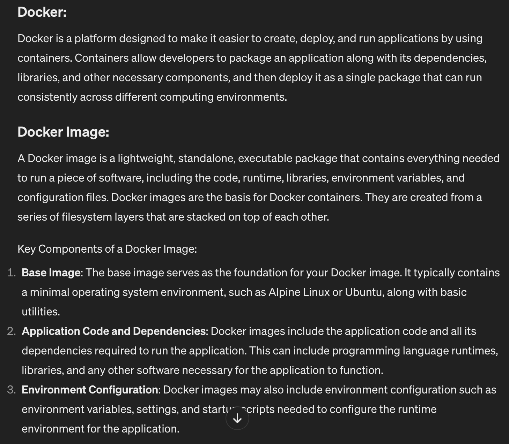

## 1 Compute Engine
We usually refer to the running VM as instance.
When using compute engine, we create and manage one or more instances

### VM Images
- Instances run images, which contains operating system, libraries nd other code.
- You can run image provided by Google,(linux and MS). Also third party public images
- You can also create a custom image from a boot disk or by starting with another image

- Google store all persistent data with encryption: google managed encryption key, customer managed encryption keys and customer supplied encryption keys
- The boot disk typically contains the necessary files and configurations for the VM to start and load the operating system. It holds the bootloader, kernel, and other essential system files required for the OS to initiate.
- vTPM validates boot integrity and provides additional protections for key generation and protection
- Using IAM or Disallow the use of project based SSH keys, which by default would allow access to any VM instance in a project
- Sole Tennacy: Don"t want VM from other projects running on the same sever as your projects VM: node affinity labels matching the labels you specify will run on the same server tgt

- Instance Template
- You can also create VM from a machine image that you create

### VM are contained in Projects

### VM Run in a Zone and Region
- Regions are geographical locations, like asia east, europe west
- Zone are data center like resources, consist of one or more closely coupled data centers, zones in aregion are linked by low latency, high bandwidth network connections

### Create VM
- User need privileges to create VM, like a member of projects etc
- User can be assocaited with a projects as Individual user,a foofle group, a coodle workspace domain, a serivce account
- z.B some predefined roles: compute admin, compute network admin, compute security admin, compute viewer

### Preemptible VM
- preemptible VMs are short lived compute instances suitable for running certian types of worklaods, like applications performing financial modellings, rendering ,big data, continuoud integration, web crawling operations
- Run up to 24 h, spot VM does not have time limit

### Custom Machine Type
- Standard, high memo, high cpu, shared core, memo optimized

### Use Cases
- Good option when you need max control over VM instances
- Chooes the specific image to run on instance
- Install software packages or custom libraries
- Have fine grained control over which users have permissions on the instance
- Have control over SSL certificates and fierwall rules for the instance

## 2 App Engine
PaaS compute service that provides a managed platform for runnning applications. 
Instead of configuring VMs, you specify some basic resource requirements along with your application code.

### Structure of App Engine Application
- app engine applications consist of services
- services provide a specific function , like computing sales tax in a retail web application,
- Services have versions, and this allow multiple version to run at one time. Each version of a service runs on an instance that is managed by App engine
- Dynamic / Resident instances

### App Engine Standard and Flexible Env
- Standard: preconfigured , language specific runtime
- Auto, basic, manual scalling
- Flexible env, uses containers as the basic building block abstracion, 
app engine flexible env users can customize the runtime env by configuring a container. Flex env uses docker
containers, so developers can specify base operating sys images addtional libraries and tools by Dockerfile

- ***Both App Engine and K8s can run customized Docker containers.***
- ***App Eigine provides a fully managed PaaS and is a good option when you can package your application and services into a small set of containers. thse containers can then be autoscaled according to load***
- ***K8s is deisnged to manage containers executing in a cluster that u control, you have control over the cluster, but u must monitor and manage the health of  cluster***

### Use Cases

- Use when u have little need to configure and contorl the underlying operating sys or storage sys

## 3 Kubernetes Engine
- Compute engines allow you to create and manage VMs either individually or in groups called instance groups
Instance group let you manage similar VMs as a sinlge unit. THis is helpful when you have a fleet of servers that run the same software a d have the same operational life cycle
- Modern software is often built as a collection of services,microservices, different services require diff configurations of VMs, but you still want to manage those instance as a single unit, then use K8s
- Create clusters of VMs,Deploy containerized applications to the cluster,Administer the cluster,Specify policies, such as autoscalling, Monitor cluster health
- GKE standard,/ GEK Autopilot

### K8s Functionality
- designed to support clusters that run a variety of applications

### K8s Cluster Architecture
- A cluster control plane and one or more worker nodes, control plane determines what containers and workloads are run on each node
- K8s API server is the coordinator for all communications to the cluster
- resource controlers, schedulers

### K8s Engine Use Cases
- Suitable for large scale applications that require high availability and high reliability
- Support concept of pods and deployment sets, helping to separate services

### Anthos
- use to manange services and resources across clouds and on-prem env
- Centrally configuring and managing the way you deploy services
- You can define and enforce policies across env

***Container: A lightweight, standalone executable package that includes everything needed to run a piece of software.***
***Node: A worker machine in the Kubernetes cluster responsible for running containers.***
***Pod: The smallest deployable unit in Kubernetes, representing one or more containers that are deployed together on the same host.***

## 4 Cloud Run
- A managed service for running containers
- Used to deploy stateless containers.
- Any instance of a container running a service can respond to requests from that service. No data is maintained in a service about a particular connection or user of the service
***A stateless container is a type of containerized application that does not maintain any state or data between individual requests or sessions. In other words, a stateless container treats each request or session independently, without relying on any information from previous requests or sessions***

### Cloud Run Use Case
- Provide services run containers
- Do not provide VMs, VMs are provided by compute engines
- Running code in containers and do not want to manage infrastrucure, application is stateless

## 5 Cloud Functions
- Serverless computing platform designed to run single purpose pieces of code in resoponse to evetns in Google cloud env
- Glue between services that are otherwise independent
- Services can change independently of each other, we should not have to keep track of dependencies between services if we can avoid it

### Cloud Function Execution Env
- The Function execution in a secure, isolated env
- Compute resources scale as neede
- The execution of one function is independetn of all others
- Cloud Functions maybe running in multiple instances at one time, and those instanes are independent

### Cloud Function Use Case
- Well suited to short running, event based processing
- Workflows upload, modify or alter files in cloud storage
- use msg queues to send work between services
- IoT, Mobile application send data to cloud for processing, asychronous workflows

***Serverless computing, often referred to as Function-as-a-Service (FaaS), is a cloud computing model in which cloud providers dynamically manage the allocation and provisioning of servers to execute code on behalf of developers. In a serverless architecture, developers focus solely on writing and deploying functions or code snippets (referred to as serverless functions) without needing to worry about the underlying infrastructure, such as servers or virtual machines.***